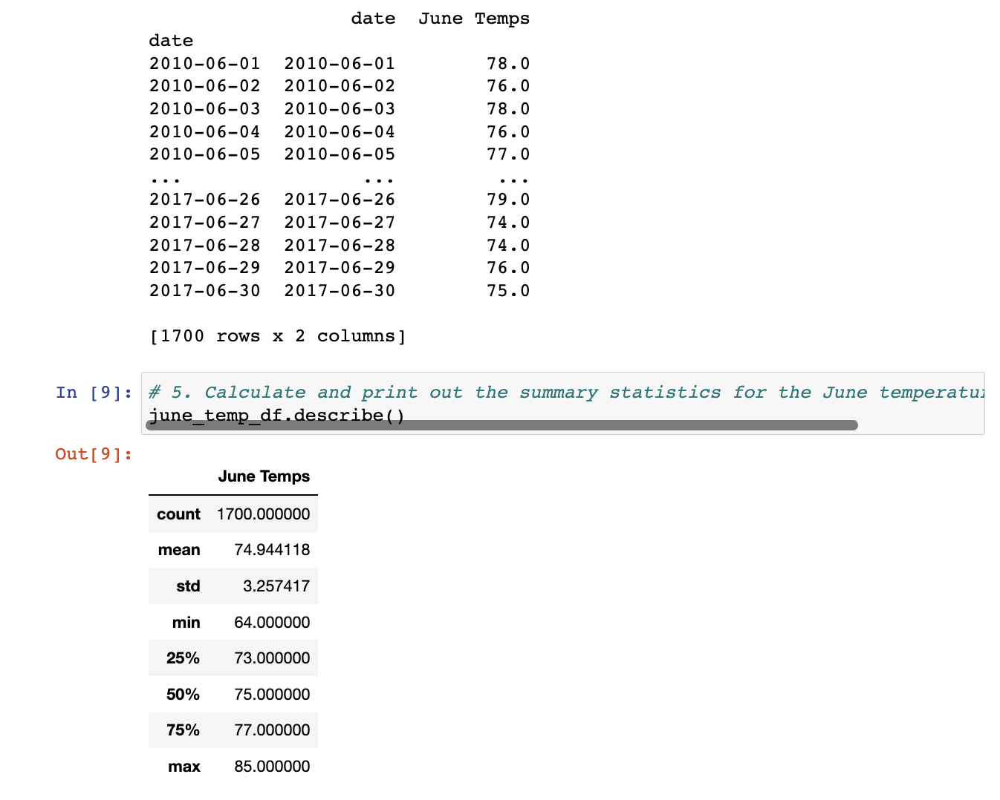
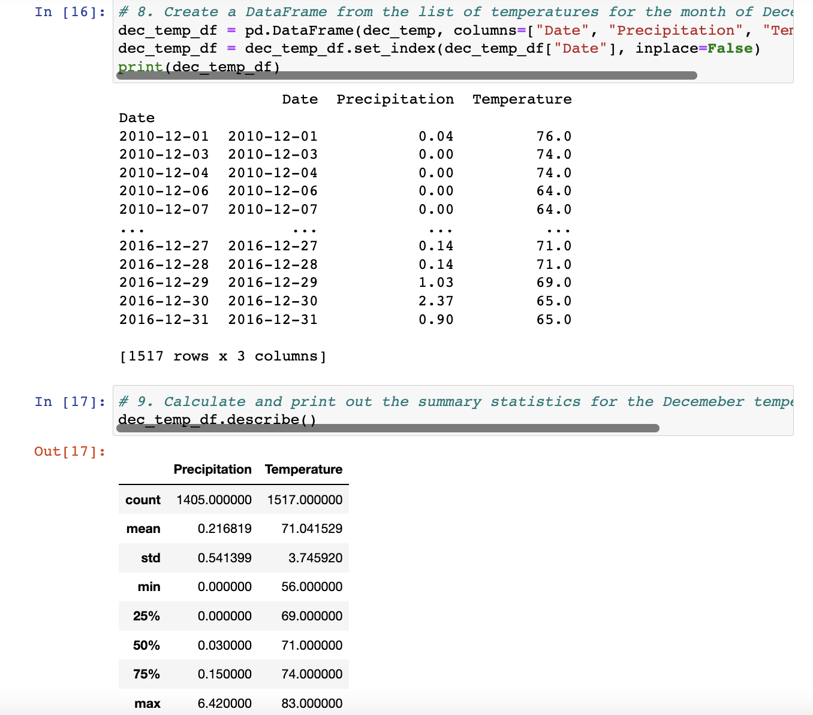

# Surfs Up

## Tools Used

• Python

• Pandas

• SQLAlchemy

## Overview and Purpose

The objective of this project is to gather temperature and precipitation data in Hawaii for the months of June and December and present it to the investor, W. Avy. To accomplish this, we employed Python, Pandas, and SQLAlchemy. These tools enabled us to retrieve the necessary temperature data, create a structured DataFrame with the collected information, and organize the data into a list format.

Using Python, we implemented SQLAlchemy to interact with the data source and extract the relevant temperature and precipitation data for the specified months in Hawaii. Subsequently, we leveraged the power of Pandas, a data manipulation library, to transform the retrieved data into a structured and analyzable DataFrame. This DataFrame serves as a comprehensive representation of the temperature and precipitation data, facilitating efficient analysis and presentation to the investor.

By employing Python, Pandas, and SQLAlchemy, we effectively retrieved, organized, and prepared the temperature and precipitation data from Hawaii for the months of June and December. This data will provide W. Avy with valuable insights into the weather patterns during these months, aiding in informed decision-making and potential investment considerations.

## Results

The following are data on the temperature and levels of precipitation in Oahu for the months of June and December.

## Summary

The analysis of the query results indicates a consistent temperature range of approximately 75-80º Fahrenheit in June and an average temperature of 71º Fahrenheit in December. Furthermore, the precipitation levels in December vary between 0-2.4 inches per day.

Based on this data, W. Avy can confidently infer that the temperature conditions during the summer months are highly favorable for a surf shop. The consistent temperatures in the 75-80º Fahrenheit range provide an ideal climate for beach-related activities, including surfing. Additionally, the relatively low precipitation levels in December further support the suitability of the location for a surf shop, as inclement weather conditions are less likely to impede outdoor activities.

With this information, W. Avy can make informed decisions regarding potential investments in a surf shop, leveraging the data to anticipate favorable conditions for attracting customers and ensuring a thriving business during the summer season.
